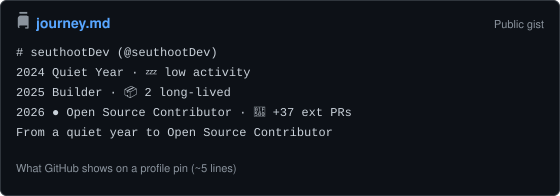

# GitHub Journey

[](LICENSE)
[](CONTRIBUTING.md)

Year-by-year archetypes from your public GitHub activity, as a **pinned Gist**.

> GitHub Stats tells you where you are.
> GitHub Journey tells you how you got there.

It looks at your last **3 years**, labels each year (Explorer, Builder, Open Source Contributor, …), and adds a one-line story under them.

---

## What a pin looks like

GitHub only shows about **5 lines** of a pinned Gist. That fold is the product:



```text
# seuthootDev (@seuthootDev)
2024 Quiet Year · 💤 low activity
2025 Builder · 📦 2 long-lived
2026 ● Open Source Contributor · 🔀 +37 ext PRs
From a quiet year to Open Source Contributor
```

`●` marks the current year. Open the Gist itself for the year-by-year table underneath.

Live example: [gist.github.com/seuthootDev/be21b22500c89de894da8b2c1c03573c](https://gist.github.com/seuthootDev/be21b22500c89de894da8b2c1c03573c)

---

## How to put this on your profile

Same pattern as [productive-box](https://github.com/maxam2017/productive-box): **fork → Action fills your Gist → pin that Gist**.

1. **[Fork this repo](https://github.com/seuthootDev/GitHub-Journey/fork)**
2. Create a **public** [Gist](https://gist.github.com/) named `journey.md` (any placeholder text) and copy its ID  
   (`https://gist.github.com/YOU/`**`GIST_ID`** — not the `.js` embed URL)
3. Create a PAT with **`gist`** scope → on **your fork**, add Secrets `GH_TOKEN` + `GIST_ID`
4. On **your fork**, add Variable `USERNAME` = your GitHub login
5. **Actions** → enable workflows if prompted → **Update Journey Gist** → **Run workflow**
6. [Pin the Gist](https://docs.github.com/en/account-and-profile/setting-up-and-managing-your-github-profile/customizing-your-profile/pinning-items-to-your-profile) on your profile

Details below.

### 1. Fork

Fork [seuthootDev/GitHub-Journey](https://github.com/seuthootDev/GitHub-Journey). Run the Action on **your fork**, not on this repo.

### 2. Create a public Gist

1. https://gist.github.com/
2. Filename **must** be `journey.md` (that is the file the Action updates)
3. Any placeholder text
4. **Create public gist**
5. Copy only the **Gist ID** from the URL

### 3. Create a token (once)

https://github.com/settings/tokens → **Tokens (classic)** → enable **`gist`** only.  
The token string is shown **once** — save it.

### 4. Secrets and Variables on **your fork**

**Settings → Secrets and variables → Actions**

**Secrets** tab:

| Secret | Value |
|--------|--------|
| `GH_TOKEN` | PAT with `gist` scope |
| `GIST_ID` | Gist ID only |

**Variables** tab:

| Variable | Value | Required |
|----------|--------|----------|
| `USERNAME` | your GitHub login | yes |
| `NAME` | display name in the Gist heading | no (falls back to `USERNAME`) |

### 5. Run the Action

1. On **your fork**: **Actions** → enable workflows if GitHub asks (forks start with them off)
2. **Update Journey Gist** → **Run workflow**
3. [Pin the Gist on your profile](https://docs.github.com/en/account-and-profile/setting-up-and-managing-your-github-profile/customizing-your-profile/pinning-items-to-your-profile)

The workflow also runs on every push to `main` and daily at 00:00 UTC.

Scheduled runs on a **public fork are off until you enable Actions**. After that, keep the fork’s Action enabled if you want the pin to refresh by itself.

---

## How it works

```
Your fork → GitHub Action
  → GitHub API (your public activity)
  → yearly metrics + rule engine
  → 3-year pin + one-liner
  → PATCH your Gist
  → pin on your profile
```

No LLM. Each year gets the first matching archetype:

| Archetype | Rough trigger |
|-----------|----------------|
| Quiet Year | activity well below *your* other years |
| Rising Star | stars gained jump vs. your baseline |
| Collaborator | reviews jump vs. your baseline |
| Open Source Contributor | enough external PRs across repos |
| Builder | several active, long-lived owned repos |
| Creator | many new repos this year |
| Explorer | several new languages in one year |
| Polyglot | wide language mix, sustained |
| Specialist | same language, deep, for 2+ years |
| Consistent | fallback when nothing else fires |

The last line is a short pattern over those three years (comeback, language switch, breakout, …). If nothing special matches: `First archetype → Last archetype in 3 years`.

These labels are **observable GitHub activity**, not a skill score.

---

## Local development

```bash
npm ci
npm test
```

Print a journey without writing a Gist:

```bash
npx tsx src/cli.ts --username=YOUR_LOGIN --name="Your Name"
```

Set `GH_TOKEN` and `GIST_ID` in the environment to PATCH the Gist instead.

---

## Contributing

PRs are welcome anytime. See [CONTRIBUTING.md](CONTRIBUTING.md).

## License

[MIT](LICENSE) © seuthootDev
